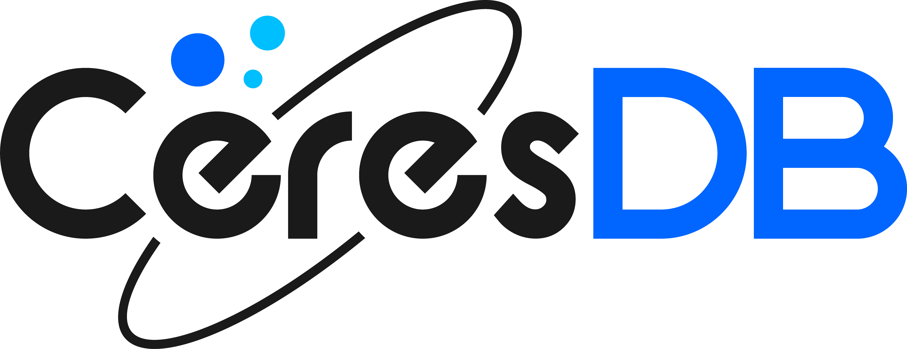

[](https://github.com/CeresDB/ceresdb/actions/workflows/ci.yml)
[](https://github.com/CeresDB/ceresdb/issues)
[](https://join.slack.com/t/ceresdbcommunity/shared_invite/zt-1au1ihbdy-5huC9J9s2462yBMIWmerTw)

[中文](./README-CN.md)

CeresDB is a high-performance, distributed, schema-less, cloud native time-series database that can handle both time-series and analytics workloads.

## Status
The project is currently under rapid development. This early stage is not production ready and may incur data corruptions.

## RoadMap

See our [RoadMap](./docs/dev/roadmap.md)

## Get started
### Clone the repository
Clone this repository by `git` and enter it:
```bash
git clone git@github.com:CeresDB/ceresdb.git
cd ceresdb
```

### Run ceresdb in docker
Ensure that `docker` is installed in your development environment, and then build the image with the provided Dockerfile:
```shell
docker build -t ceresdb .
```

Start the ceresdb container using the built docker image:
```shell
docker run -d -t --name ceresdb -p 5440:5440 -p 8831:8831 ceresdb
```

### Compile and run CeresDB
#### Install dependencies
In order to compile CeresDB, some relevant dependencies(including `Rust` toolchain) should be installed.

#### Dependencies(Ubuntu20.04)
Assuming the development environment is Ubuntu20.04, execute the following command to install the required dependencies:
```shell
apt install git curl gcc g++ libssl-dev pkg-config cmake
```

It should be noted that the compilation of the project actually has version requirements for some dependencies such as cmake, gcc, g++, etc. If your development environment is an old Linux distribution, it is necessary to manually install these dependencies of a higher version.

#### Rust
`Rust` can be installed by [rustup](https://rustup.rs/). After installing rustup, when entering the CeresDB project, the specified `Rust` version will be automatically downloaded according to the rust-toolchain file.

After execution, you need to add environment variables to use the `Rust` toolchain. Basically, just put the following commands into your `~/.bashrc` or `~/.bash_profile`:
```shell
source $HOME/.cargo/env
```

#### Compile and run
Compile CeresDB by the following command:
```
cargo build --release
```

Then you can run CeresDB using the default configuration file provided in the codebase.
```bash
./target/release/ceresdb-server --config ./docs/example.toml
```

### Write and read data
CeresDB supports custom extended SQL protocol. Currently, you can create tables and read/write data with SQL statements through http service.

#### Create table
```shell
curl --location --request POST 'http://127.0.0.1:5440/sql' \
--header 'Content-Type: application/json' \
--data-raw '{
    "query": "CREATE TABLE `demo` (`name` string TAG, `value` double NOT NULL, `t` timestamp NOT NULL, TIMESTAMP KEY(t)) ENGINE=Analytic with (enable_ttl='\''false'\'')"
}'
```

#### Write data
```shell
curl --location --request POST 'http://127.0.0.1:5440/sql' \
--header 'Content-Type: application/json' \
--data-raw '{
    "query": "INSERT INTO demo(t, name, value) VALUES(1651737067000, '\''ceresdb'\'', 100)"
}'
```

#### Read data
```shell
curl --location --request POST 'http://127.0.0.1:5440/sql' \
--header 'Content-Type: application/json' \
--data-raw '{
    "query": "select * from demo"
}'
```

#### Show create table
```shell
curl --location --request POST 'http://127.0.0.1:5440/sql' \
--header 'Content-Type: application/json' \
--data-raw '{
    "query": "show create table demo"
}'
```

#### Drop table
```shell
curl --location --request POST 'http://127.0.0.1:5440/sql' \
--header 'Content-Type: application/json' \
--data-raw '{
    "query": "DROP TABLE demo"
}'
```

## Contributing
Any contribution is welcome!

Read our [Contributing Guide](./docs/community/CONTRIBUTING.md) and make your first contribution!

## Architecture and Technical Documentation
Our technical documents(still under writing and polishing) describes critical parts of ceresdb in the [docs](docs).

## Acknowledgment
Some design of CeresDB references [influxdb_iox](https://github.com/influxdata/influxdb_iox), and some specific module implementations reference [tikv](https://github.com/tikv/tikv) and other excellent open source projects, thanks to InfluxDB, TiKV, and any other referenced great open source projects.

## Licensing
CeresDB is under [Apache License 2.0](./LICENSE).

## Community and support
- Check our community [roles](docs/community/ROLES.md)
- Join the user group on [Slack](https://join.slack.com/t/ceresdbcommunity/shared_invite/zt-1au1ihbdy-5huC9J9s2462yBMIWmerTw) 
- Contact us via Email: ceresdbservice@gmail.com
- WeChat group [QR code](https://github.com/CeresDB/assets/blob/main/WeChatQRCode.jpg) 
- Join the user group on DingTalk: 44602802
